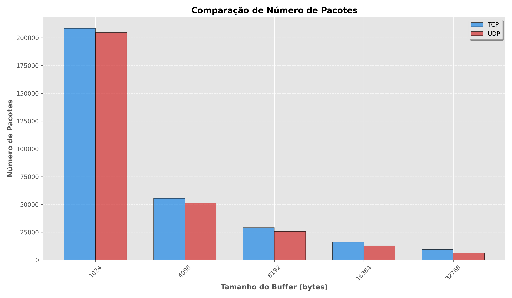
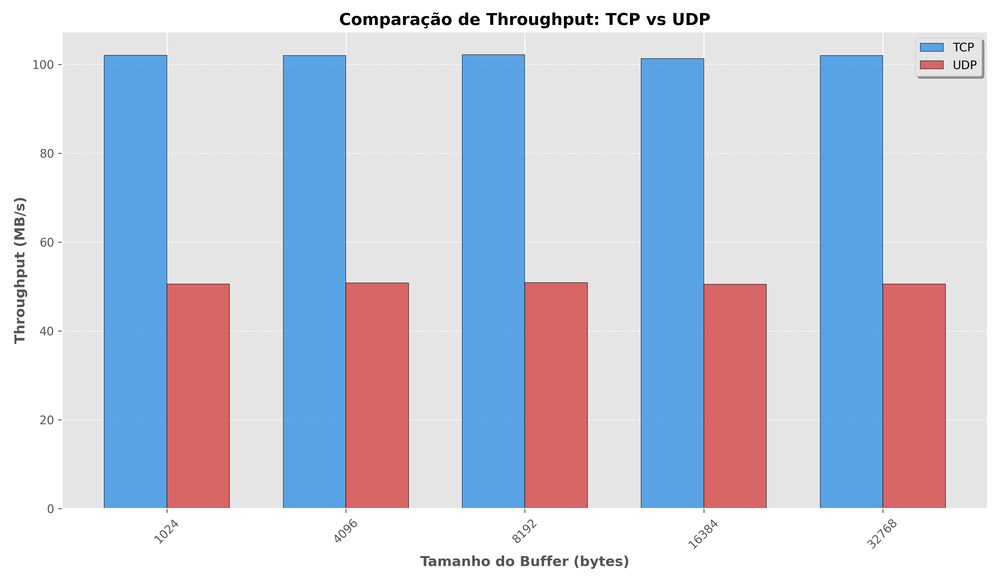
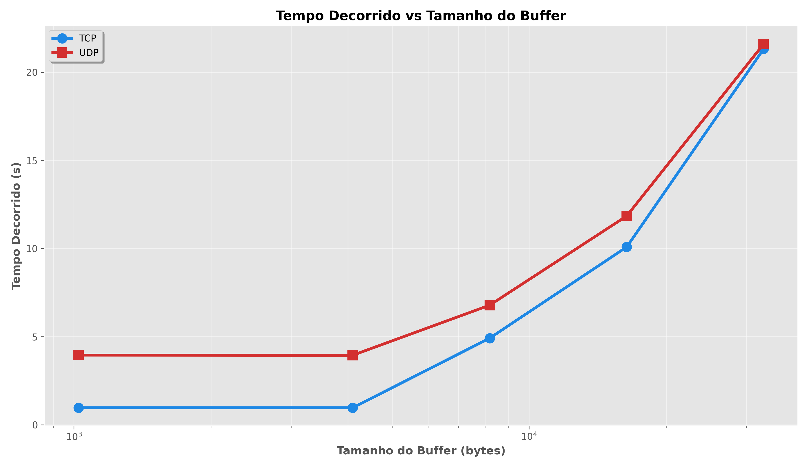
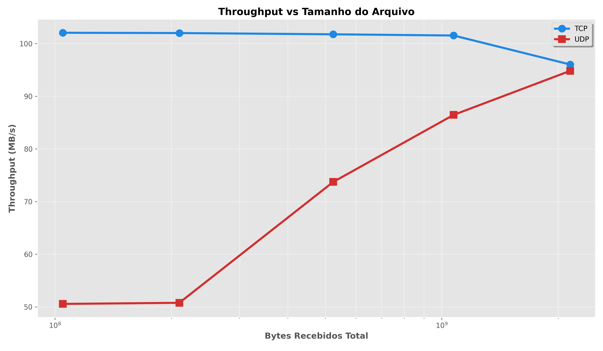
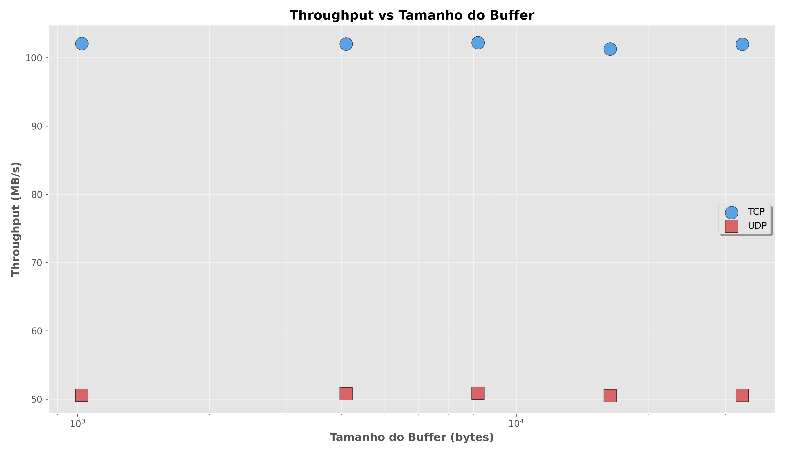

# Trabalho Prático de Redes de Computadores II - Turma 2024/2
# **Relatório de Benchmark: TCP vs UDP**

## Alunos
- **Bernardo Tomasi** - GRR20223827
- **Eric Kivel** - GRR20220069

## Introdução

Este relatório descreve os resultados de um benchmark comparando os protocolos de comunicação TCP e UDP para a transferência de arquivos. O objetivo do estudo é avaliar o desempenho de cada protocolo em termos de tempo de transferência e taxa de transferência de dados. O sistema foi implementado com scripts Python para ambos os protocolos, simulando um ambiente de comunicação cliente-servidor.

## Arquivos do Sistema

O sistema é composto por quatro arquivos principais:

- **[tcp.client.py - Download](tcp.client.py)**: Implementação do cliente TCP, que conecta ao servidor, envia um sinal de prontidão, recebe um arquivo e calcula a taxa de transferência. - <a href="assets/tcp.client.py.txt">Ou abra o arquivo aqui</a>
- **[tcp.server.py - Download](tcp.server.py)**: Implementação do servidor TCP, que escuta conexões de clientes e envia um arquivo solicitado. - <a href="assets/tcp.server.py.txt">Ou abra o arquivo aqui</a>
- **[udp.client.py - Download](udp.client.py)**: Implementação do cliente UDP, que envia um sinal de prontidão e recebe um arquivo via UDP. - <a href="assets/udp.client.py.txt">Ou abra o arquivo aqui</a>
- **[udp.server.py - Download](udp.server.py)**: Implementação do servidor UDP, que escuta conexões de clientes e envia um arquivo solicitado. - <a href="assets/udp.server.py">Ou abra o arquivo aqui</a>

Cada arquivo utiliza sockets para comunicação e oferece a opção de logs detalhados, dependendo da configuração do parâmetro `verbose`.

## Como Executar

1. **Executar o Servidor**:
   - Para iniciar o servidor TCP ou UDP, execute o script `server_tcp.py` ou `server_udp.py` respectivamente.
   - Exemplo de execução:
     ```bash
     python server_tcp.py --host <ip> --port <porta> --file <caminho_do_arquivo> -v
     ```

2. **Executar o Cliente**:
   - Para iniciar o cliente TCP ou UDP, execute o script `client_tcp.py` ou `client_udp.py` respectivamente.
   - Exemplo de execução:
     ```bash
     python client_tcp.py --host <ip> --port <porta> --output <caminho_do_arquivo> -v
     ```

## Métricas Calculadas

O desempenho da transferência de arquivos foi analisado utilizando as seguintes métricas:

- **Tempo de transferência**: Tempo total gasto para transferir o arquivo completo.
- **Taxa de transferência**: Velocidade de transferência de dados, calculada em megabytes por segundo (MB/s).
- **Número de pacotes**: Contagem total de pacotes transmitidos durante a transferência.
- **Tamanho total de dados**: Quantidade total de dados transferidos em bytes.


## Execução dos Testes

Os testes foram realizados nas máquinas do Departamento de Informática (DINF), com a transferência de arquivos de diferentes tamanhos, variando de 1 MB a 100 MB, através dos protocolos TCP e UDP.
Para realizar o teste foi utilizado um script chamado `test_client.sh` (<a href="test_client.sh">Aqui</a>) para automatizar a execução de testes com diferentes tamanhos de arquivo e tamanhos de buffer. O servidor, enquanto isso, ficava ligado escutando as conexões.

1. **Configuração de Rede**: Todos os testes ocorreram em uma rede local, utilizando servidores e clientes com configurações fixas de IP e porta.
2. **Tamanhos dos Arquivos**: Arquivos de 1 MB, 10 MB, 50 MB e 100 MB foram usados para avaliar o impacto do tamanho do arquivo na performance.
3. **Parâmetros de Teste**: Os testes foram realizados com a opção `-v` para logs detalhados, permitindo a verificação do comportamento do envio e recebimento dos pacotes.

## Resultados

### Resultados em CSV  
Os resultados completos dos testes estão disponíveis nos arquivos CSV, que podem ser acessados nos links abaixo:  

- [Resultados TCP](assets/metricas_tcp.csv)  
- [Resultados UDP](assets/metricas_udp.csv)  

Esses arquivos contêm informações detalhadas sobre o desempenho de cada protocolo, incluindo o tempo de transferência, taxa de transferência, e número de pacotes para diferentes tamanhos de arquivos e buffers.  

- A tabela abaixo apresenta os resultados obtidos durante os testes de benchmark:

| Total de Bytes Recebidos (MB/GB) | Protocolo | Média do Tempo Decorrido (s) | Média do Número de Pacotes | Média da Taxa de Transferência (MB/s) |
|----------------------------------|-----------|------------------------------|----------------------------|-------------------------------------|
| 100 MB                           | TCP       | 0.99                         | 28,368                     | 101.33                              |
| 100 MB                           | UDP       | 2.98                         | 6,400                      | 33.58                               |
| 200 MB                           | TCP       | 1.96                         | 70,066                     | 102.12                              |
| 200 MB                           | UDP       | 3.94                         | 41,395                     | 50.73                               |
| 500 MB                           | TCP       | 4.91                         | 134,217                    | 101.78                              |
| 500 MB                           | UDP       | 6.79                         | 64,800                     | 73.56                               |
| 1 GB                             | TCP       | 10.08                        | 282,843                    | 101.55                              |
| 1 GB                             | UDP       | 11.84                        | 104,857                    | 86.48                               |
| 2 GB                             | TCP       | 21.32                        | 1,328,780                  | 96.05                               |
| 2 GB                             | UDP       | 21.75                        | 901,052                    | 93.69                               |


- **Comparação de Número de Pacotes:**

O TCP enviou um número maior de pacotes do que o UDP para todos os tamanhos de buffer testados. Essa diferença é mais notável nos buffers menores, como 1024 bytes, mas diminui à medida que o tamanho do buffer aumenta.



- **Comparação de Throughput: TCP vs UDP:**

O throughput do TCP é consistentemente mais alto do que o do UDP, independentemente do tamanho do buffer. O TCP atinge cerca de 100 MB/s, enquanto o UDP fica próximo a 50 MB/s.



- **Tempo Decorrido vs Tamanho do Buffer:**

O tempo de transmissão aumenta com o tamanho do buffer para ambos os protocolos. O UDP apresenta tempos de transmissão ligeiramente maiores em comparação ao TCP, especialmente em buffers maiores.



- **Throughput vs Tamanho do Arquivo:**

O throughput do TCP é consistentemente mais alto do que o do UDP, porém conforme a tamanho dos arquivos aumentam o UDP se aproxima do TCP.



- **Throughput vs Tamanho do Buffer:**

O throughput do TCP é maior que o UDP independentemente do buffer.



## Logs

Durante a execução dos testes, os logs detalhados fornecem informações cruciais sobre o andamento das transferências e o comportamento de cada protocolo. A seguir, alguns exemplos dos logs gerados durante a execução do protocolo TCP e UDP:

### Log Exemplo de Cliente TCP

```
Iniciando conexão com o servidor TCP...
Enviando sinal de prontidão...
Arquivo recebido com sucesso.
Tempo de transferência: 0.99 segundos.
Taxa de transferência: 101.33 MB/s.
Número de pacotes enviados: 28,368.
```

### Log Exemplo de Cliente UDP

```
Iniciando conexão com o servidor UDP...
Enviando sinal de prontidão...
Arquivo recebido com sucesso.
Tempo de transferência: 2.98 segundos.
Taxa de transferência: 33.58 MB/s.
Número de pacotes enviados: 6,400.
```

### Log Exemplo de Servidor TCP

```
Servidor TCP iniciado na porta 12345...
Aguardando conexão de cliente...
Cliente conectado.
Enviando arquivo...
Transferência concluída.
```

### Log Exemplo de Servidor UDP

```
Servidor UDP iniciado na porta 12345...
Aguardando pacotes do cliente...
Arquivo enviado com sucesso.
Transferência concluída.
```

Esses logs são úteis para monitorar o comportamento do sistema, especialmente para identificar a quantidade de pacotes enviados e o tempo necessário para a transferência. Com a opção `-v`, o cliente e o servidor geram esses logs detalhados para facilitar a análise do desempenho da transferência.

## Conclusão

A partir dos testes realizados, podemos concluir que:

- O protocolo **TCP** apresentou melhor desempenho em termos de tempo de transferência, sendo mais rápido que o **UDP** para todos os tamanhos de arquivos testados. No entanto, o TCP precisou enviar um número significativamente maior de pacotes, o que reflete o seu controle mais rigoroso sobre a entrega e a confiabilidade dos dados.
  
- O **UDP** transferiu menos pacotes em comparação ao TCP, mas teve um desempenho inferior em termos de tempo de transferência e taxa de transferência, especialmente para arquivos maiores. Apesar disso, o UDP pode ser vantajoso em situações onde a perda de pacotes é aceitável e a velocidade de envio é mais importante que a confiabilidade.

Portanto, o **TCP** deve ser preferido quando a integridade e confiabilidade dos dados são essenciais, enquanto o **UDP** pode ser uma opção viável para aplicações que priorizam a velocidade e toleram perdas ou precisam de baixa sobrecarga de pacotes.
Além disso, os resultados sugerem que o melhor desempenho do TCP em throughput e tempo de transferência se deve ao seu controle de fluxo e de congestionamento, que otimiza a utilização da capacidade da rede para atingir a maior taxa de transmissão possível.
